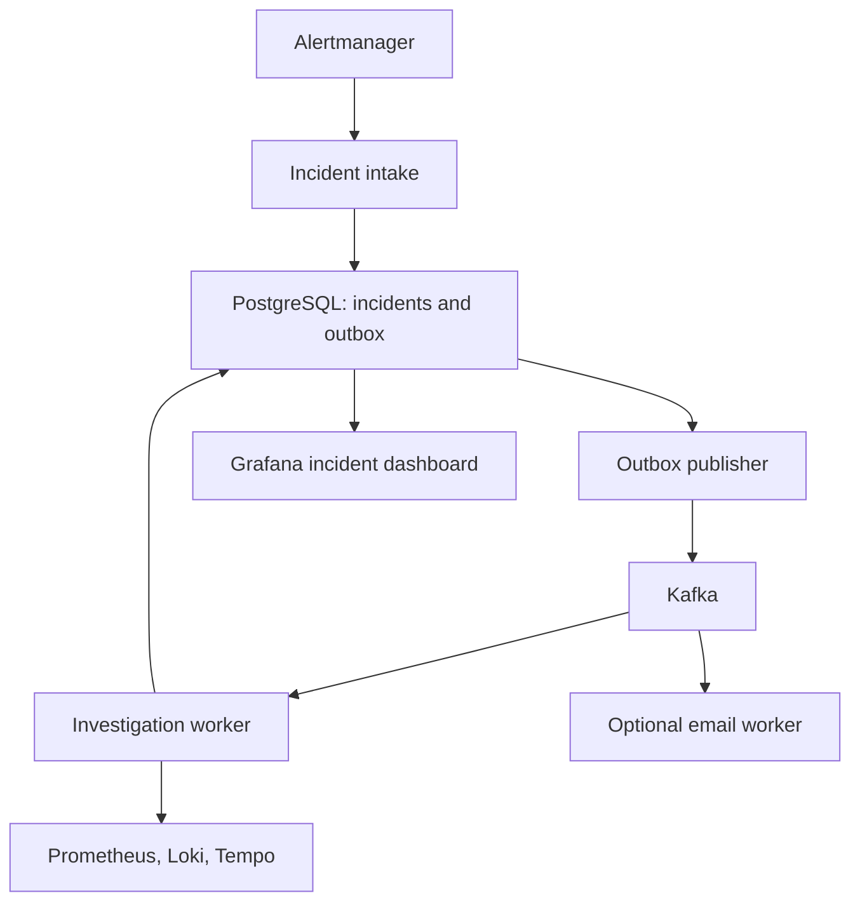

# Micro Observe Kafka

A Java incident investigation service that collects metrics, error logs, and traces
when an alert fires. PostgreSQL stores the incident and an outbox event in one
transaction; Kafka carries the investigation and notification work. Grafana shows
incident history alongside service telemetry. Email is optional.

The core problem is getting the relevant telemetry into one report when a service
fails. Reports contain observed values and suggested checks. They do not infer a
root cause, invent a confidence score, or call a model provider.

## Workflow

1. Order and Inventory produce request metrics, logs, and traces.
2. Prometheus evaluates alert rules; Alertmanager groups and forwards alerts.
3. Incident intake saves the incident and its investigation event atomically.
4. The outbox publisher sends the event to Kafka.
5. A worker queries a five-minute window ending when collection starts. It records
   available metrics, bounded error logs, trace summaries, and collection failures.
6. The report is saved with a notification outbox event. Grafana reads PostgreSQL;
   the optional notification service consumes Kafka events and sends email.
7. A resolved alert closes the incident and queues a recovery notification.



Incidents move from `RECEIVED` to `INVESTIGATING`, then `INVESTIGATED` or
`INVESTIGATION_FAILED`. Resolution can happen at any stage. Late or repeated
worker completion cannot reopen a resolved incident or replace a completed report.

## Structure

| Directory | Responsibility |
| --- | --- |
| `incident-service` | Alert intake, evidence collection, incident storage and outbox |
| `notification-service` | Incident and recovery email |
| `order-service`, `inventory-service` | Small workload for failure demonstrations |
| `api-gateway` | Workload routes and read-only incident API |
| `ops/observability` | Prometheus, Alertmanager, Grafana and Tempo configuration |
| `ops/postgres` | Application database initialization |
| `scripts` | Repeatable local smoke test |

Java 25, Spring Boot, Spring Cloud Gateway, Kafka, PostgreSQL, Flyway, Micrometer,
Prometheus, Loki, Tempo, Grafana, and Docker Compose.

## Run locally on Windows

Install Docker Desktop with Compose and start it. Docker builds the Java services;
you do not need Java or Maven installed for the Compose walkthrough.

From the repository directory in PowerShell:

```powershell
Copy-Item .env.example .env
```

Choose `POSTGRES_PASSWORD` and `GRAFANA_ADMIN_PASSWORD` in `.env`, then run:

```powershell
docker compose config --quiet
docker compose up --build -d --remove-orphans
docker compose ps
```

Do not overwrite an existing `.env` or change an existing database password without
also updating that database. The initial build downloads several large images.
Wait for the Java containers to become healthy before testing.

| Service | Local address |
| --- | --- |
| Incident API | http://localhost:8084/api/incidents |
| Grafana | http://localhost:3000 |
| Gateway | http://localhost:9000 |
| Prometheus | http://localhost:9090 |
| Alertmanager | http://localhost:9093 |

Everything published by Compose binds to localhost by default. Kafka and PostgreSQL
are reachable only within the Docker network. Leave Kafka UI and email disabled
while learning the core workflow, especially on an 8 GB laptop. If Docker is
running out of memory, close other applications and check `docker stats`; the full
observability stack still needs substantial memory without those optional services.

## Retest the incident flow

Run the smoke test in PowerShell:

```powershell
.\scripts\smoke-test.ps1
```

It submits a synthetic webhook, checks duplicate firing alerts return the same ID,
waits for Kafka processing, checks the evidence report, then verifies resolution
and duplicate resolution. Each run uses a new fingerprint and attempts to resolve
its test incident in `finally`.

This checks intake, PostgreSQL, the outbox, Kafka, the worker, and the read API.
An unavailable telemetry source appears in the report; it is not treated as proof
of healthy service. This test does not prove Prometheus alert evaluation, SMTP
delivery, or useful telemetry content. Use the failure demonstration below for that.

## Demonstrate a real failure and recovery

Add `SPRING_PROFILES_ACTIVE=observability,demo` to `.env` and recreate Inventory:

```powershell
docker compose up --build -d inventory-service
docker compose exec postgres psql -U observe -d inventory_service -c "INSERT INTO t_inventory (sku_code, quantity) VALUES ('keyboard-001', 25) ON CONFLICT (sku_code) DO UPDATE SET quantity = 25;"
```

Wait for Inventory to become healthy. Generate about five minutes of slow requests:

```powershell
try {
    Invoke-RestMethod -Method Post -Uri 'http://localhost:8082/demo/failures?latencyMillis=3000&failRequests=false'
    1..100 | ForEach-Object {
        Invoke-RestMethod -Uri 'http://localhost:8082/api/inventory?skuCode=keyboard-001&quantity=1' -TimeoutSec 15 | Out-Null
    }
} finally {
    Invoke-RestMethod -Method Delete -Uri 'http://localhost:8082/demo/failures'
}
```

While traffic runs, open Prometheus Alerts and watch `HighResponseLatency` become
firing. Check Alertmanager, then Grafana's incident dashboard and the Incident API.
The report should contain latency samples, with logs and traces when available.
After resetting the failure, allow the five-minute metric window and alert grouping
delays to clear before expecting `RESOLVED`. Remove `demo` from `.env` and recreate
Inventory when finished. Failure injection is for local walkthroughs only.

## Optional email

Set `SMTP_HOST`, `SMTP_PORT`, `SMTP_USERNAME`, `SMTP_PASSWORD`, `NOTIFICATION_FROM`,
and `ALERT_EMAIL_TO` in `.env`. For an SMTP server without authentication or STARTTLS,
set `SMTP_AUTH=false` and `SMTP_STARTTLS=false` only for that trusted local server.

```powershell
docker compose --profile email up --build -d notification-service
docker compose logs -f notification-service
```

Rerun the smoke test after starting email. Expect an investigation and recovery
notification; duplicates are possible because delivery is at least once. A successful
SMTP send means the server accepted the message, not that it reached the inbox.
Never commit SMTP credentials. If you previously copied a real password from the
old `.env.example`, revoke it and issue a new one.

Kafka UI is also optional:

```powershell
docker compose --profile tools up -d kafka-ui
```

Open http://localhost:8086. Prometheus still has a notification-service scrape
target when email is disabled; that target will be down. The default unavailable
service alert excludes this optional service.

## Build and test

For Java tests outside Docker, install JDK 25. The repository includes Maven Wrapper:

```powershell
.\mvnw.cmd -pl incident-service -am test
.\mvnw.cmd verify
```

On Linux/macOS use `sh ./mvnw` instead. Full reactor verification requires Docker
because workload and notification context tests use Testcontainers. GitHub Actions
runs verification, validates Compose with optional profiles, and builds the incident
container. Focused tests cover report sanitization, missing evidence, trace inclusion,
late resolution races, and duplicate result notifications.

## Upgrading from the old module

The module and Compose service are now `incident-service`. Stop the previous stack
with `docker compose --profile email down` before switching branches, then rebuild
with `--remove-orphans`. Keep database volumes; do not use `down -v` to upgrade.

Back up `incident_platform` first if its history matters. Flyway V1 is unchanged;
V2 removes the obsolete `probable_root_cause` and `confidence` columns. Those two
fields are also removed from the API and new notification events. Existing evidence,
incident IDs, outbox entries, and lifecycle history are retained. The notification
consumer ignores obsolete fields in queued older events. Upgrade both Java services
together; rolling back to the old module requires restoring the database backup.

Remove old provider variables from your local `.env`; they are no longer used.

## Limits and follow-up work

- The API accepts `scope=active|resolved|all`, `page`, and `size`, capped at 100.
- Reports normalize text and bound lists; telemetry collection defaults to 10 log
  lines, with a configurable limit of 50. Common secrets and email addresses are redacted.
- Resolved incidents expire after 30 days; published outbox entries after 7 days.
  Override these with `INCIDENT_RESOLVED_RETENTION_DAYS` and
  `INCIDENT_OUTBOX_RETENTION_DAYS`.
- Sequential repeated alerts are deduplicated by active fingerprint. A database
  constraint prevents concurrent duplicate rows, but concurrent webhook requests
  can still need retry. Resolved-before-firing and stale alert episodes need further work.
- The outbox provides at-least-once publication, not exactly-once delivery. Run one
  incident-service instance with this configuration. Multi-replica claiming and
  durable notification deduplication are not implemented.
- Investigation errors are stored as `INVESTIGATION_FAILED`. There is no DLQ/replay
  interface yet. Check service logs; after fixing the cause, reset and retrigger the
  demo. Partial telemetry failures remain visible in the report.
- The collection window ends at worker execution time. Replaying an old alert does
  not reconstruct its historical window. Deployment correlation and richer incident
  lifecycle management are follow-up work.

## Local or deployed?

Local is sufficient for development and a portfolio walkthrough. Include the
architecture, passing test output, and a short failure-to-recovery recording.
A permanent public deployment is optional.

For a hosted demonstration, a Linux VM running Docker Compose is the simplest
extension of this setup. DigitalOcean Docker Droplets or Hetzner Cloud are options.
As an initial planning estimate, use 4 vCPU / 8 GB RAM and measure actual usage;
this repository does not include a capacity benchmark. Build services sequentially
if memory is tight. This is a backend stack, not a static site suitable for Netlify.

Start with a private demo accessed through SSH port forwarding; keep the localhost
bindings. Do not expose Kafka, PostgreSQL, telemetry APIs, or demo failure endpoints.
Public access requires authentication, TLS, firewall rules, secret management,
backups and a recovery plan. This single-node Compose stack is not highly available.

## Useful commands

```powershell
docker compose logs --tail=200 incident-service
docker compose logs -f inventory-service order-service
docker compose ps
docker stats
docker compose --profile email --profile tools down
```

`down` stops containers and keeps volumes. Avoid `down -v` unless you intentionally
want to delete the local databases and telemetry history.
