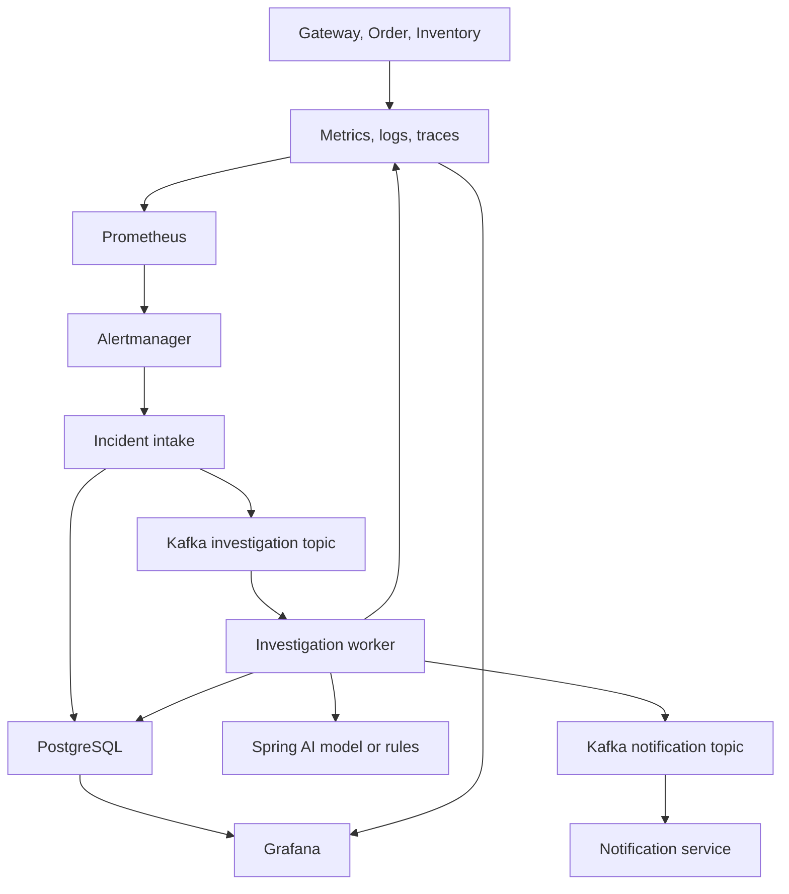

# IncidentLens

IncidentLens is a small incident investigation platform built with Java and
Spring. It starts with a normal service failure, collects the related metrics,
logs, and traces, and turns that evidence into an incident report. The report is
stored in PostgreSQL, displayed in Grafana, and sent to the configured operations
email address.

The project runs without an AI key. In that mode it uses a rule-based
investigator, which makes it easier to learn the incident flow before adding a
model.

## The problem

Monitoring tools tell us that a threshold was crossed. They do not usually
connect the alert with recent logs, slow traces, affected services, and a short
list of next steps. Engineers still do that correlation manually.

This repository automates the first investigation pass:

1. Prometheus detects a service symptom.
2. Alertmanager groups and forwards the alert.
3. The incident service records it and queues an investigation.
4. A worker reads a small evidence window from Prometheus, Loki, and Tempo.
5. Spring AI or the local rules produce a structured report.
6. Grafana and email show the result.

The model explains evidence; it does not decide whether an incident exists.
Alerting remains deterministic and reviewable.

## Architecture



The incident state moves through:

```text
RECEIVED -> INVESTIGATING -> INVESTIGATED -> RESOLVED
                         `-> INVESTIGATION_FAILED
```

Incident state and outgoing Kafka messages are written with a transactional
outbox. This avoids saving an incident while losing its investigation event.
Repeated firing and resolved webhooks are handled idempotently.

## Project structure

```text
.
├── api-gateway/             Routes workload and read-only incident requests
├── order-service/           Creates orders and calls Inventory
├── inventory-service/       Checks stock and hosts controlled failure modes
├── ai-incident-analyzer/    Receives alerts, gathers evidence, runs analysis
├── notification-service/    Sends incident and recovery emails
├── ops/postgres/            Creates the three application databases
├── api-gateway/docker/
│   ├── prometheus/          Scrape configuration and alert rules
│   ├── alertmanager/        Alert grouping and webhook routing
│   ├── grafana/             Datasources and incident dashboard
│   └── tempo/               Trace storage configuration
├── docker-compose.yml       Complete local environment
├── Dockerfile               Shared multi-stage Java image build
└── pom.xml                  Maven reactor and shared dependency versions
```

The workload services exist to generate useful telemetry. They are kept small so
the incident path remains the main subject of the repository.

## Stack

| Area | Technology |
| --- | --- |
| Application | Java 25, Spring Boot, Spring Cloud Gateway |
| Investigation | Spring AI with typed responses and a rule-based fallback |
| Messaging | Kafka with two JSON event topics |
| Storage | PostgreSQL, JPA, Flyway |
| Metrics and alerts | Micrometer, Prometheus, Alertmanager |
| Logs and traces | Loki, Tempo, Micrometer Tracing |
| Dashboard | Grafana |
| Local environment | Docker Compose |

## Run locally

You need Git and Docker with Docker Compose. Java and Maven are only required if
you want to run or test modules outside Docker.

Clone the repository and create the local environment file:

```bash
git clone https://github.com/Abhay123abhi/micro-observe-kafka.git
cd micro-observe-kafka
cp .env.example .env
```

Set these values in `.env`:

```dotenv
POSTGRES_PASSWORD=choose-a-local-password
GRAFANA_ADMIN_PASSWORD=choose-a-grafana-password

SMTP_USERNAME=your-smtp-user
SMTP_PASSWORD=your-smtp-app-password
NOTIFICATION_FROM=your-verified-sender@example.com
ALERT_EMAIL_TO=your-email@example.com
```

Start the stack:

```bash
docker compose up --build -d
docker compose ps
```

Wait until the Java services report `healthy`. The first build takes longer
because Maven dependencies and container images must be downloaded.

| Service | Local URL |
| --- | --- |
| API Gateway | http://localhost:9000 |
| Incident API | http://localhost:8084/api/incidents |
| Grafana | http://localhost:3000 |
| Prometheus | http://localhost:9090 |
| Alertmanager | http://localhost:9093 |
| Loki | http://localhost:3100 |
| Tempo | http://localhost:3200 |

Ports bind to `127.0.0.1` by default. Keep that setting for local use. The stack
does not include the authentication and TLS required for public internet access.

Kafka UI is optional:

```bash
docker compose --profile tools up -d kafka-ui
```

Open http://localhost:8086 to inspect the two incident topics.

## AI configuration

The default is local rule-based analysis:

```dotenv
AI_ENABLED=false
AI_CHAT_PROVIDER=none
```

To use OpenAI through Spring AI:

```dotenv
AI_ENABLED=true
AI_CHAT_PROVIDER=openai
OPENAI_API_KEY=your-key
AI_MODEL=gpt-5-mini
```

An OpenAI-compatible provider can be used by setting `OPENAI_BASE_URL` and the
provider's model name. Restart the analyzer after changing these values:

```bash
docker compose up --build -d ai-incident-analyzer
```

Evidence sent to the provider is limited and redacted. Prompt and completion
logging is disabled. Do not commit `.env`.

## Trigger an incident

Add the `demo` profile in `.env`:

```dotenv
SPRING_PROFILES_ACTIVE=observability,demo
```

Restart Inventory and insert a sample item:

```bash
docker compose up --build -d inventory-service
docker compose exec postgres psql -U observe -d inventory_service \
  -c "INSERT INTO t_inventory (sku_code, quantity) VALUES ('keyboard-001', 25) ON CONFLICT (sku_code) DO NOTHING;"
```

Enable five seconds of latency:

```bash
curl -X POST "http://localhost:8082/demo/failures?latencyMillis=5000&failRequests=false"
```

Generate traffic long enough for the alert rule to fire:

```bash
for i in $(seq 1 40); do
  curl --silent "http://localhost:9000/api/inventory?skuCode=keyboard-001&quantity=1" > /dev/null
done
```

Follow the result in this order:

1. Check the `HighResponseLatency` rule in Prometheus.
2. Check the grouped alert in Alertmanager.
3. Open the incident dashboard in Grafana.
4. Call `GET http://localhost:8084/api/incidents`.
5. Check the configured email inbox.

Remove the failure:

```bash
curl -X DELETE http://localhost:8082/demo/failures
```

When the Prometheus rule clears, Alertmanager sends a resolved webhook. The same
incident is marked `RESOLVED` and a recovery email is queued.

## Useful commands

```bash
# Follow application logs
docker compose logs -f api-gateway order-service inventory-service ai-incident-analyzer notification-service

# Check container health
docker compose ps

# Build and run all Java tests outside Docker
sh ./mvnw verify

# Stop containers but keep data
docker compose down

# Remove containers and local data
docker compose down -v
```

Use the final command only when you want a clean PostgreSQL, Kafka, Prometheus,
Loki, Tempo, and Grafana state.

## Troubleshooting

**A Java service stays unhealthy**

```bash
docker compose logs --tail=200 <service-name>
```

Check database credentials, SMTP values, and whether PostgreSQL and Kafka are
healthy.

**No incident appears**

Confirm that the Prometheus rule is firing, then check Alertmanager and analyzer
logs. Alert rules contain a `for` duration, so a short burst may not create an
incident.

**No AI request is made**

Confirm `AI_ENABLED=true`, `AI_CHAT_PROVIDER=openai`, and a valid provider key.
When provider configuration fails, the analyzer falls back to the rule-based
implementation.

**No email arrives**

Use an SMTP app password when the provider requires one. Check
`notification-service` logs for authentication or sender-verification errors.

## Operational notes

- Alert labels are validated before they are used in telemetry queries.
- Logs are bounded and redact common credentials and email addresses.
- AI output is normalized before it is stored or included in email.
- Outbound HTTP clients use connection and read timeouts.
- Java containers run as a non-root user with Linux capabilities removed.
- GitHub Actions builds and tests the reactor and checks dependency changes.
- Dependabot watches Maven, container images, Compose, and workflow actions.

For public deployment, add authentication, TLS, managed secrets, protected Kafka
and PostgreSQL connections, backup policies, and retention limits. The supplied
Compose file is intended for local development and project walkthroughs.
