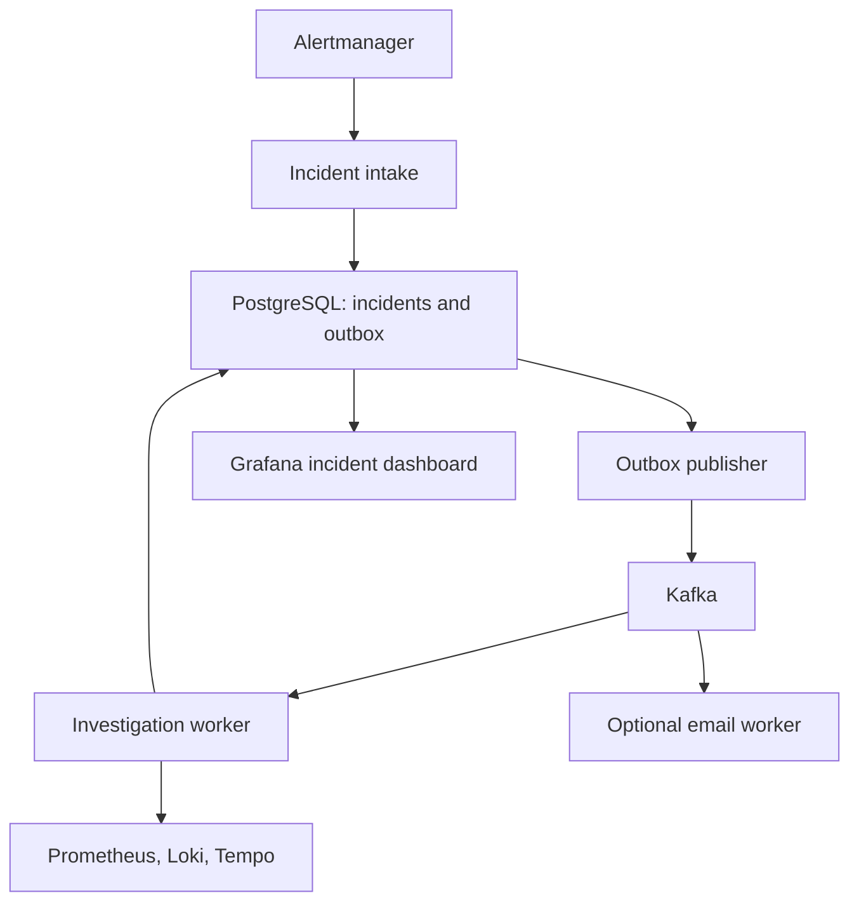

# Micro Observe Kafka

A Java incident investigation service that collects metrics, error logs, and traces
when an alert fires. PostgreSQL stores the incident and an outbox event in one
transaction; Kafka carries the investigation and notification work. Grafana shows
incident history alongside service telemetry. Email is optional.

## Problem and approach

During a service failure, engineers must move between alert dashboards, metrics,
logs and traces to collect enough context to investigate. Repeated notifications
add noise, and a failure between saving an incident and publishing work can leave
an incident without an investigation. Copying every application log into the
incident database would also make incident history expensive to store and query.

This project assembles a bounded evidence report for each distinct active alert:

- Alertmanager handles alert grouping and routing. Incident intake reuses the
  active incident for sequential repeated webhooks with the same fingerprint.
- PostgreSQL stores incident state and the outgoing work in one transaction.
  An outbox publisher retries publication to Kafka when the broker is unavailable.
- A Kafka worker collects selected metrics, error samples and trace summaries.
  Raw telemetry stays in its source system; only a small snapshot is stored with
  the incident. Source failures are included in the report.
- Grafana and the Incident API expose the stored report. Optional email announces
  investigation and recovery. Late investigation results cannot reopen resolved
  incidents.
- Pagination, bounded report fields and scheduled database retention limit some
  growth. They do not provide a complete disk budget or unlimited processing capacity.

The result is a persistent starting point for investigation, reducing manual
collection work. The service does not establish a root cause or measure a proven
reduction in recovery time. Its value is the reliable incident workflow built around
existing telemetry tools.

## Workflow

1. Order and Inventory produce request metrics, logs, and traces.
2. Prometheus evaluates alert rules; Alertmanager groups and forwards alerts.
3. Incident intake saves the incident and its investigation event atomically.
4. The outbox publisher sends the event to Kafka.
5. A worker queries a five-minute window ending when collection starts. It records
   available metrics, bounded error logs, trace summaries, and collection failures.
6. The report is saved with a notification outbox event. Grafana reads PostgreSQL;
   the optional notification service consumes Kafka events and sends email.
7. A resolved alert closes the incident and queues a recovery notification.



Incidents move from `RECEIVED` to `INVESTIGATING`, then `INVESTIGATED` or
`INVESTIGATION_FAILED`. Resolution can happen at any stage. Late or repeated
worker completion cannot reopen a resolved incident or replace a completed report.

## Structure

| Directory | Responsibility |
| --- | --- |
| `incident-service` | Alert intake, evidence collection, incident storage and outbox |
| `notification-service` | Incident and recovery email |
| `order-service`, `inventory-service` | Small workload for failure demonstrations |
| `api-gateway` | Workload routes and read-only incident API |
| `ops/observability` | Prometheus, Alertmanager, Grafana and Tempo configuration |
| `ops/postgres` | Application database initialization |
| `scripts` | Repeatable local smoke test |

Java 25, Spring Boot, Spring Cloud Gateway, Kafka, PostgreSQL, Flyway, Micrometer,
Prometheus, Loki, Tempo, Grafana, and Docker Compose.

## Run locally on Windows

Install Docker Desktop with Compose and start it. Docker builds the Java services;
you do not need Java or Maven installed for the Compose walkthrough.

From the repository directory in PowerShell:

```powershell
Copy-Item .env.example .env
```

Choose `POSTGRES_PASSWORD` and `GRAFANA_ADMIN_PASSWORD` in `.env`, then run:

```powershell
docker compose config --quiet
docker compose up --build -d --remove-orphans
docker compose ps
```

Do not overwrite an existing `.env` or change an existing database password without
also updating that database. The initial build downloads several large images.
Wait for the Java containers to become healthy before testing.

| Service | Local address |
| --- | --- |
| Incident API | http://localhost:8084/api/incidents |
| Grafana | http://localhost:3000 |
| Gateway | http://localhost:9000 |
| Prometheus | http://localhost:9090 |
| Alertmanager | http://localhost:9093 |

Everything published by Compose binds to localhost by default. Kafka and PostgreSQL
are reachable only within the Docker network. Leave Kafka UI and email disabled
while learning the core workflow, especially on an 8 GB laptop. If Docker is
running out of memory, close other applications and check `docker stats`; the full
observability stack still needs substantial memory without those optional services.

## Retest the incident flow

Run the smoke test in PowerShell:

```powershell
.\scripts\smoke-test.ps1
```

It submits a synthetic webhook, checks duplicate firing alerts return the same ID,
waits for Kafka processing, checks the evidence report, then verifies resolution
and duplicate resolution. Each run uses a new fingerprint and attempts to resolve
its test incident in `finally`.

This checks intake, PostgreSQL, the outbox, Kafka, the worker, and the read API.
An unavailable telemetry source appears in the report; it is not treated as proof
of healthy service. This test does not prove Prometheus alert evaluation, SMTP
delivery, or useful telemetry content. Use the failure demonstration below for that.

## Demonstrate a real failure and recovery

Add `SPRING_PROFILES_ACTIVE=observability,demo` to `.env` and recreate Inventory:

```powershell
docker compose up --build -d inventory-service
docker compose exec postgres psql -U observe -d inventory_service -c "INSERT INTO t_inventory (sku_code, quantity) VALUES ('keyboard-001', 25) ON CONFLICT (sku_code) DO UPDATE SET quantity = 25;"
```

Wait for Inventory to become healthy. Generate about five minutes of slow requests:

```powershell
try {
    Invoke-RestMethod -Method Post -Uri 'http://localhost:8082/demo/failures?latencyMillis=3000&failRequests=false'
    1..100 | ForEach-Object {
        Invoke-RestMethod -Uri 'http://localhost:8082/api/inventory?skuCode=keyboard-001&quantity=1' -TimeoutSec 15 | Out-Null
    }
} finally {
    Invoke-RestMethod -Method Delete -Uri 'http://localhost:8082/demo/failures'
}
```

While traffic runs, open Prometheus Alerts and watch `HighResponseLatency` become
firing. Check Alertmanager, then Grafana's incident dashboard and the Incident API.
The report should contain latency samples, with logs and traces when available.
After resetting the failure, allow the five-minute metric window and alert grouping
delays to clear before expecting `RESOLVED`. Remove `demo` from `.env` and recreate
Inventory when finished. Failure injection is for local walkthroughs only.

## Optional email and testing toggle

`EMAIL_NOTIFICATIONS_ENABLED=false` is the default. The Compose `email` profile
controls whether the notification service runs; the switch controls whether that
running service sends mail. For repeated testing, keep the consumer running and
mute sending with the switch.


Set `SMTP_HOST`, `SMTP_PORT`, `SMTP_USERNAME`, `SMTP_PASSWORD`, `NOTIFICATION_FROM`,
and `ALERT_EMAIL_TO` in `.env`. For an SMTP server without authentication or STARTTLS,
set `SMTP_AUTH=false` and `SMTP_STARTTLS=false` only for that trusted local server.

```powershell
docker compose --profile email up --build -d notification-service
docker compose logs -f notification-service
```

To turn sending **on**, set this in `.env`:

```dotenv
EMAIL_NOTIFICATIONS_ENABLED=true
```

To turn sending **off**, change it to:

```dotenv
EMAIL_NOTIFICATIONS_ENABLED=false
```

After either change, recreate only the notification container:

```powershell
docker compose --profile email up -d --force-recreate notification-service
```

Use `--build` too when first installing this code change. `docker compose restart`
does not reload environment changes. This is a restart-applied switch, not a live
UI toggle. Turning it off cannot recall a message already accepted by SMTP.

When off, the Kafka listener still consumes notifications, records
`incident_notification_suppressed_total` and returns normally without rendering
email or contacting SMTP. SMTP health checks are disabled too. Events successfully
consumed and committed while muted are not deliberately held for later delivery.
Stopping the consumer instead leaves a backlog subject to Kafka retention; enabling
email before that backlog is drained can send older notifications.

Test with the service running and sending off: run `.\scripts\smoke-test.ps1`, confirm
no email arrives, and inspect
`http://localhost:8083/actuator/metrics/incident.notification.suppressed`.
Then turn sending on, recreate the container and rerun the smoke test with valid
SMTP settings. Expect an investigation and recovery notification; duplicates are possible because delivery is at least once. The switch mutes all
email; it does not add throttling, digests or durable delivery deduplication. A successful
SMTP send means the server accepted the message, not that it reached the inbox.
Never commit SMTP credentials. If you previously copied a real password from the
old `.env.example`, revoke it and issue a new one.

Kafka UI is also optional:

```powershell
docker compose --profile tools up -d kafka-ui
```

Open http://localhost:8086. Prometheus still has a notification-service scrape
target when email is disabled; that target will be down. The default unavailable
service alert excludes this optional service.

## Build and test

For Java tests outside Docker, install JDK 25. The repository includes Maven Wrapper:

```powershell
.\mvnw.cmd -pl incident-service -am test
.\mvnw.cmd verify
```

On Linux/macOS use `sh ./mvnw` instead. Full reactor verification requires Docker
because workload and notification context tests use Testcontainers. GitHub Actions
runs verification, validates Compose with optional profiles, and builds the incident
container. Focused tests cover report sanitization, missing evidence, trace inclusion,
late resolution races, and duplicate result notifications.

## Upgrading from the old module

The module and Compose service are now `incident-service`. Stop the previous stack
with `docker compose --profile email down` before switching branches, then rebuild
with `--remove-orphans`. Keep database volumes; do not use `down -v` to upgrade.

Back up `incident_platform` first if its history matters. Flyway V1 is unchanged;
V2 removes the obsolete `probable_root_cause` and `confidence` columns. Those two
fields are also removed from the API and new notification events. Existing evidence,
incident IDs, outbox entries, and lifecycle history are retained. The notification
consumer ignores obsolete fields in queued older events. Upgrade both Java services
together; rolling back to the old module requires restoring the database backup.

Remove old provider variables from your local `.env`; they are no longer used.

## Storage and growing data volumes

Raw error logs, incident records and Kafka work events are different data types.
A log line does not automatically create an incident: an alert rule must fire and
Alertmanager must forward it. Multiple distinct fingerprints can still create many
incidents; this is not cross-alert incident correlation.

| Data | Stored in | Current limits and lifecycle |
| --- | --- | --- |
| Incident state and evidence snapshot | PostgreSQL `incidents`, in `postgres-data` | Indexed incident metadata plus JSONB evidence, affected-service and recommendation lists. Resolved records are eligible for deletion 30 days after resolution. Active and investigation-failed records are not automatically expired. |
| Outgoing investigation and notification events | PostgreSQL `outbox_events`, in `postgres-data` | JSON payload, topic, aggregate ID and publication timestamps. Published events are eligible for deletion after 7 days. Unpublished events are retained for retry, with no backlog cap. |
| Investigation and notification messages | Kafka topics, in `kafka-data` | Retained independently of PostgreSQL. This repository does not explicitly set topic retention or byte limits; broker/topic defaults apply. Consumption does not immediately delete a message. |
| Raw application logs | Loki, in `loki-data` | The stack uses the image's local configuration. No project-specific retention/compactor policy or disk budget is configured. |
| Raw trace data | Tempo, in `tempo-data` | Local block storage. No project-specific trace retention or disk budget is configured; component defaults apply. |
| Time-series metrics | Prometheus, in `prometheus-data` | Explicit 7-day time retention. No size-based retention is configured. |
| Container stdout/stderr | Docker logging storage on the host | Separate from Loki. No rotation policy is configured in Compose; Docker daemon settings apply. |

Docker named volumes survive container restarts and `docker compose down`. On
Docker Desktop they consume host-backed storage inside Docker's Linux environment.
They are persistence, not backups, remote storage or unlimited capacity.

### How much evidence is copied into an incident?

The worker queries a five-minute window ending when collection starts. It requests
up to 10 log lines by default (configurable up to 50), then the report selects up to
3 error samples and 5 trace summaries alongside metrics and collection notes.
Report lists are capped at 20 entries each, and each entry is capped at 1,000
characters. These are character/list limits, not a guaranteed byte size. Full logs
and trace spans are not copied into PostgreSQL. The saved snapshot can outlive the
raw telemetry, but opening an old trace requires it still to exist in Tempo.

Database cleanup runs with a one-hour fixed delay after completion, initially five
minutes after startup. Records become eligible at the configured age; deletion is
not an exact TTL deadline and requires a healthy running incident service. Deleting
rows also does not guarantee the database volume immediately shrinks on disk.

### What happens during a failure storm?

Repeated firing webhooks for one active fingerprint reuse its incident. Distinct
fingerprints create separate incidents and outbox events. The publisher reads up
to 100 pending events per pass; that bounds a publishing batch, not the total queue.
Kafka decouples intake from investigation, so temporary bursts can accumulate as
consumer lag. If incoming work keeps exceeding processing capacity, the backlog
and investigation delay continue to grow.

If Kafka is down, unpublished outbox entries accumulate in PostgreSQL. If workers
are down, Kafka messages accumulate subject to Kafka retention. Retention can remove
messages before a slow or stopped consumer processes them. Queueing therefore buys
time; it does not guarantee unlimited buffering or prevent disk exhaustion.

The current setup handles a local demo and provides some bounded data handling.
It has no measured high-volume capacity, per-service intake rate limit, complete
storage budget, automatic archival or multi-instance worker coordination.

### Next steps before sustained high-volume use

These are proposed improvements, not enabled features:

1. Configure and verify Loki compactor retention, explicit Tempo retention, Kafka
   time/byte retention, Prometheus size retention and Docker log rotation. Preserve
   free-space headroom; retention thresholds are not exact disk quotas.
2. Monitor disk usage, oldest unpublished outbox age, pending outbox count, Kafka
   consumer lag and investigation duration. Define operational thresholds before
   accepting more load.
3. Set an intake rate limit and an explicit overload response/retry policy. Add
   bounded retries, a dead-letter queue and controlled replay for failed work.
4. Define ownership and review/archival rules for unresolved and failed incidents.
   Never silently delete pending investigations just to reduce disk use.
5. Batch database cleanup and measure query/index performance. Consider time
   partitioning, archival or object storage only when measured volume warrants it.
6. Load-test the pipeline, then add partitions and workers together with safe
   outbox claiming and durable idempotency before running multiple instances.

For capacity planning, estimate each store separately. For example, assuming
1,000 distinct resolved incidents/day, 10 KB per stored report and 30 retained days,
report content alone would be about 300 MB. This is illustrative, not a benchmark;
indexes, outbox payloads, unresolved records, PostgreSQL overhead and raw telemetry
are additional. Raw log volume can exceed incident-report volume by a large margin.

Loki requires explicit retention configuration; filesystem storage does not delete
logs simply because the disk is nearly full. See the [Loki retention documentation](https://grafana.com/docs/loki/latest/operations/storage/retention/)
and [filesystem storage behavior](https://grafana.com/docs/loki/latest/configure/storage/).
Kafka byte retention applies per partition, not to the entire cluster; see
[Kafka topic configuration](https://kafka.apache.org/41/configuration/topic-configs/).
Prometheus also needs room for ongoing writes and compaction beyond retained blocks;
see [Prometheus storage guidance](https://prometheus.io/docs/prometheus/latest/storage/).

## Limits and follow-up work

- The API accepts `scope=active|resolved|all`, `page`, and `size`, capped at 100.
- Reports normalize text and bound lists; telemetry collection defaults to 10 log
  lines, with a configurable limit of 50. Common secrets and email addresses are redacted.
- Resolved incidents expire after 30 days; published outbox entries after 7 days.
  Override these with `INCIDENT_RESOLVED_RETENTION_DAYS` and
  `INCIDENT_OUTBOX_RETENTION_DAYS`.
- Sequential repeated alerts are deduplicated by active fingerprint. A database
  constraint prevents concurrent duplicate rows, but concurrent webhook requests
  can still need retry. Resolved-before-firing and stale alert episodes need further work.
- The outbox provides at-least-once publication, not exactly-once delivery. Run one
  incident-service instance with this configuration. Multi-replica claiming and
  durable notification deduplication are not implemented.
- Investigation errors are stored as `INVESTIGATION_FAILED`. There is no DLQ/replay
  interface yet. Check service logs; after fixing the cause, reset and retrigger the
  demo. Partial telemetry failures remain visible in the report.
- The collection window ends at worker execution time. Replaying an old alert does
  not reconstruct its historical window. Deployment correlation and richer incident
  lifecycle management are follow-up work.

## Local or deployed?

Local is sufficient for development and a portfolio walkthrough. Include the
architecture, passing test output, and a short failure-to-recovery recording.
A permanent public deployment is optional.

For a hosted demonstration, a Linux VM running Docker Compose is the simplest
extension of this setup. DigitalOcean Docker Droplets or Hetzner Cloud are options.
As an initial planning estimate, use 4 vCPU / 8 GB RAM and measure actual usage;
this repository does not include a capacity benchmark. Build services sequentially
if memory is tight. This is a backend stack, not a static site suitable for Netlify.

Start with a private demo accessed through SSH port forwarding; keep the localhost
bindings. Do not expose Kafka, PostgreSQL, telemetry APIs, or demo failure endpoints.
Public access requires authentication, TLS, firewall rules, secret management,
backups and a recovery plan. This single-node Compose stack is not highly available.

## Useful commands

```powershell
docker compose logs --tail=200 incident-service
docker compose logs -f inventory-service order-service
docker compose ps
docker stats
docker compose --profile email --profile tools down
```

`down` stops containers and keeps volumes. Avoid `down -v` unless you intentionally
want to delete the local databases and telemetry history.
