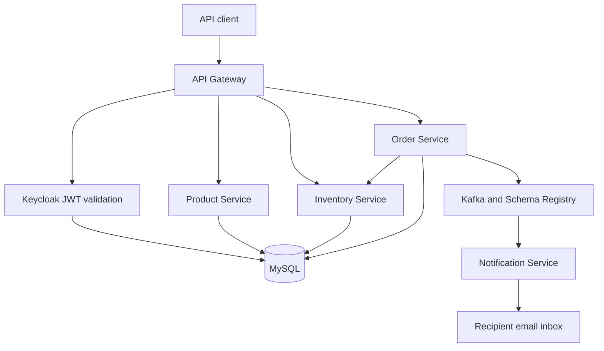

# Micro Observe Kafka

A containerized, event-driven backend built with Java 25, Spring Boot 4, Kafka,
MySQL, Keycloak, and an optional Grafana observability stack.

## Architecture



Each application service owns its own database. Keycloak uses a fourth database
on the same MySQL server. Kafka runs in KRaft mode, so ZooKeeper is not needed.

| Service | Responsibility | Local URL |
| --- | --- | --- |
| API Gateway | Authentication, routing, and aggregated OpenAPI | http://localhost:9000 |
| Product Service | Product catalog | http://localhost:8080 |
| Inventory Service | Stock availability | http://localhost:8082 |
| Order Service | Order persistence and Kafka events | http://localhost:8081 |
| Notification Service | Order confirmation emails | http://localhost:8083 |
| Keycloak | OAuth2, OpenID Connect, and JWT issuance | http://localhost:8181 |
| Schema Registry | Avro event schemas | http://localhost:8085 |
| Grafana | Dashboards; optional `observability` profile | http://localhost:3000 |
| Prometheus | Metrics; optional `observability` profile | http://localhost:9090 |
| Kafka UI | Topic inspection; optional `tools` profile | http://localhost:8086 |
| ML Detector | Optional `ai` profile | http://localhost:8000 |

## Prerequisites

- Docker and Docker Compose.
- Git.

Java, Maven, MySQL, Kafka, and Keycloak do not need to be installed on the host.

## Start the backend

```bash
git clone https://github.com/Abhay123abhi/micro-observe-kafka.git
cd micro-observe-kafka
cp .env.example .env
```

Set these required values in `.env`:

```dotenv
MYSQL_ROOT_PASSWORD=<your-generated-value>
KEYCLOAK_ADMIN_PASSWORD=<your-generated-value>
KEYCLOAK_CLIENT_SECRET=<your-generated-value>
GRAFANA_ADMIN_PASSWORD=<your-generated-value>
SMTP_USERNAME=<your-smtp-username>
SMTP_PASSWORD=<your-smtp-app-password>
NOTIFICATION_FROM=<your-sender-address>
```

Use a different strong value for each secret. For Gmail, use an app password
for `SMTP_PASSWORD`. `.env` is ignored by Git.

Start the complete backend:

```bash
docker compose up --build -d
```

Inspect startup and service health:

```bash
docker compose ps
docker compose logs -f api-gateway
```

The first build downloads dependencies and images. Subsequent builds reuse the
Docker and Maven caches.

## Authentication

Keycloak imports the `spring-microservices-security-realm` automatically.
The `spring-client-credentials-id` client uses the OAuth2 client-credentials
flow, and its secret is read from `KEYCLOAK_CLIENT_SECRET`.

Request an access token:

```bash
curl -s -X POST \
  http://localhost:8181/realms/spring-microservices-security-realm/protocol/openid-connect/token \
  -H 'Content-Type: application/x-www-form-urlencoded' \
  --data-urlencode 'grant_type=client_credentials' \
  --data-urlencode 'client_id=spring-client-credentials-id' \
  --data-urlencode "client_secret=${KEYCLOAK_CLIENT_SECRET}"
```

Export the same client secret in your shell before running that command, or
replace `${KEYCLOAK_CLIENT_SECRET}` with the value stored in `.env`.

The service account has `ADMIN` and `USER` realm roles. Creating products
requires `ADMIN`; placing orders requires `USER` or `ADMIN`.

## Exercise the order flow

Store the `access_token` from the previous response in a shell variable:

```bash
export ACCESS_TOKEN=<access-token>
```

Create a product through the gateway:

```bash
curl -X POST http://localhost:9000/api/product \
  -H "Authorization: Bearer ${ACCESS_TOKEN}" \
  -H 'Content-Type: application/json' \
  -d '{"name":"Mechanical keyboard","description":"Wireless keyboard","price":99.99}'
```

Add inventory for a product SKU:

```bash
docker compose exec mysql mysql -u root -p inventory_service \
  -e "INSERT INTO t_inventory (sku_code, quantity) VALUES ('keyboard-001', 25);"
```

Place an order:

```bash
curl -X POST http://localhost:9000/api/order \
  -H "Authorization: Bearer ${ACCESS_TOKEN}" \
  -H 'Content-Type: application/json' \
  -d '{"skuCode":"keyboard-001","price":99.99,"quantity":1,"userDetails":{"email":"customer@example.com","firstName":"Abhay","lastName":"Jaiswal"}}'
```

The Order Service checks inventory, stores the order, and publishes an Avro
event to Kafka. The Notification Service consumes that event and sends a real
confirmation email through the configured SMTP account. The responsive email
includes the order reference, product SKU, quantity, total, and placement time.

Aggregated API documentation is available at:

```text
http://localhost:9000/swagger-ui.html
```

## Optional profiles

Enable Kafka UI:

```bash
docker compose --profile tools up --build -d
```

Enable Grafana, Prometheus, Loki, and Tempo:

```bash
docker compose --profile observability up --build -d
```

To forward application logs to Loki and emit traces, also set these values in
`.env`, then rerun the same command:

```dotenv
SPRING_PROFILES_ACTIVE=observability
TRACING_ENABLED=true
```

Grafana requires the configured administrator password and provisions
Prometheus, Loki, and Tempo automatically.

Enable the optional anomaly detector:

```bash
docker compose --profile ai up --build -d
```

Profiles can be combined:

```bash
docker compose --profile observability --profile tools --profile ai up --build -d
```

## Build and tests

The GitHub Actions workflow builds and tests all five services, validates the
Compose configuration, and verifies that a production Docker image can be built.

If Java 25 is installed locally, run:

```bash
sh ./mvnw verify
```

## Deployment

The same service images can be deployed to a Linux server, a container hosting
platform, or Kubernetes. Supply environment variables through the hosting
platform rather than committing an `.env` file.

Merges to `main` publish application images to GitHub Container Registry. Use
those images for future hosting deployments instead of building on a small
server. A public deployment also requires HTTPS, a real Keycloak public URL,
protected monitoring endpoints, and persistent storage for MySQL and Kafka.

## Stop the stack

```bash
docker compose down
```

Named volumes remain available after the stack stops.
