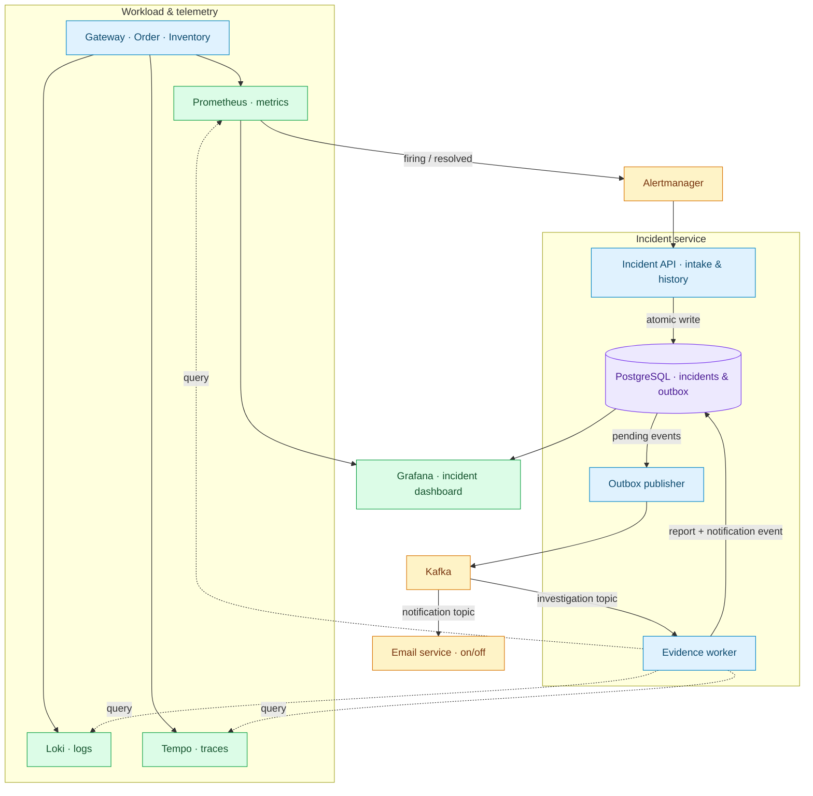

# Micro Observe Kafka

**Event-driven incident investigation · Java 25 · Spring Boot · Kafka**

Collect metrics, error logs and traces into a persistent incident report when a service alert fires.

[Architecture](#architecture) · [Run locally](#run-locally) · [Testing](docs/testing.md) · [Operations & retention](docs/operations.md)

## Problem → solution

| Problem | What this project does |
| --- | --- |
| Incident evidence is scattered across monitoring tools | Collects a five-minute telemetry snapshot into one report |
| A broker outage can interrupt investigation dispatch | Saves incident state and an outbox event in one PostgreSQL transaction; retries publication |
| Repeated alerts create noise | Reuses the active incident for repeated webhooks with the same fingerprint |
| Recovery can arrive before investigation finishes | Keeps resolved incidents closed when late worker results arrive |

## Architecture



**Flow:** detect → persist → queue → collect evidence → report → resolve.
Grafana displays stored reports and metrics; the worker queries Loki and Tempo for supporting evidence.

## Tools & design

| Layer | Tools / responsibility |
| --- | --- |
| Backend | Java 25, Spring Boot, Spring Cloud Gateway; Order and Inventory demo services |
| Messaging | Kafka investigation and notification topics; transactional outbox; at-least-once publication |
| Persistence | PostgreSQL, JPA, Flyway; indexed incident history and bounded JSONB evidence |
| Observability | Micrometer, Prometheus, Alertmanager, Loki, Tempo, Grafana |
| Quality & delivery | JUnit, Mockito, Testcontainers, Maven Wrapper, Docker Compose, GitHub Actions |

Reports include metrics, sampled errors, trace summaries and collection failures. Raw telemetry stays in its source system. History is paginated; email sending defaults to off.

## Run locally

**Requires:** Git and running Docker Desktop with Compose. Docker builds Java for you.

```sh
git clone https://github.com/Abhay123abhi/micro-observe-kafka.git
cd micro-observe-kafka
```

Create `.env` from `.env.example` (`Copy-Item .env.example .env` in PowerShell, `cp .env.example .env` on Linux/macOS). Set `POSTGRES_PASSWORD` and `GRAFANA_ADMIN_PASSWORD`.

```sh
docker compose up --build -d --remove-orphans
docker compose ps
```

Wait for the Java services to become **healthy**. Existing installations: read the [upgrade steps](docs/operations.md#upgrading-from-the-old-module) first.

| Open | Address |
| --- | --- |
| Grafana | http://localhost:3000 — user `admin`, password from `.env` |
| Incident API | http://localhost:8084/api/incidents |
| Prometheus / Alertmanager | http://localhost:9090 / http://localhost:9093 |
| API Gateway | http://localhost:9000 |

**Smoke test — PowerShell:**

```powershell
.\scripts\smoke-test.ps1
```

Checks intake, duplicate alerts, queued investigation and resolution. For a real latency failure, email setup and Java tests, see the [testing guide](docs/testing.md).

**Email switch:** set `EMAIL_NOTIFICATIONS_ENABLED=true` or `false` in `.env`, configure SMTP when enabling, then apply:

```sh
docker compose --profile email up --build -d --force-recreate notification-service
```

## Storage & scope

Resolved reports: **30 days after resolution**. Published outbox events: **7 days after publication**. Metrics: **7 days**. Active incidents and unpublished events have no automatic expiry; Kafka, Loki and Tempo have no explicit project retention policy. [Full storage reference →](docs/operations.md#storage-and-growing-data-volumes)

Designed for a local, single-instance demo. Delivery can repeat; DLQ/replay and multi-instance coordination are future work. Services bind to localhost. [Operational limits →](docs/operations.md#limits-and-follow-up-work)
